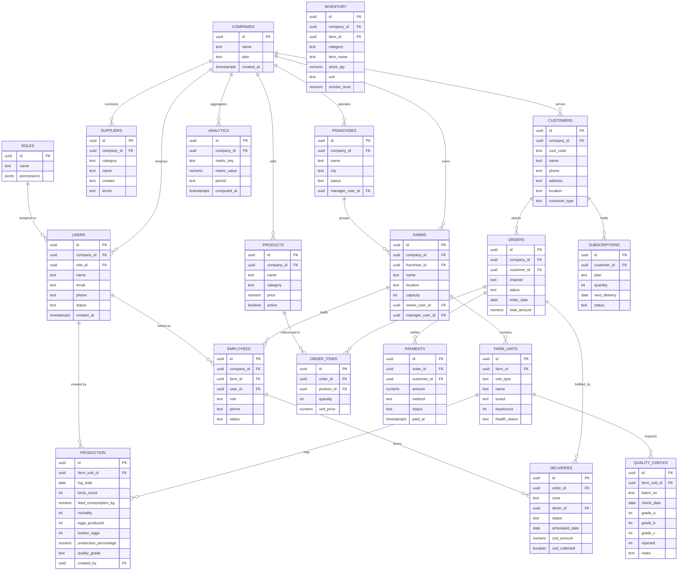
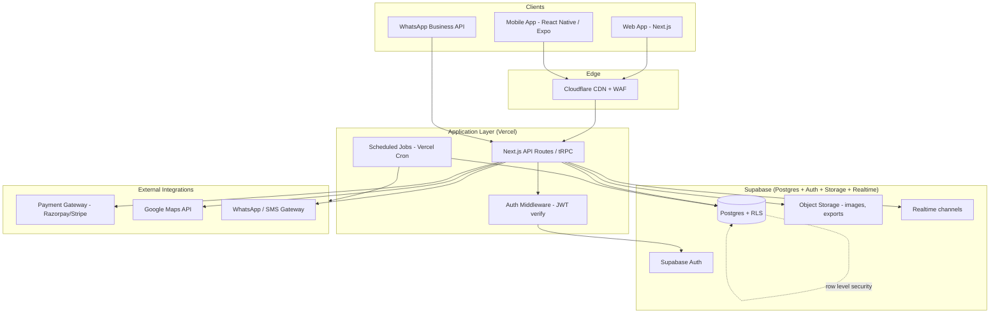

# Eden Nest ERP — Technical Blueprint
### "The Operating System for Farm-to-Consumer Agriculture Businesses"

**Version:** 1.0 · **Prepared for:** Eden Nest Farm (Kerala) — designed to scale into a multi-tenant SaaS product
**Status:** Planning document — precedes the first line of production code

---

## Table of Contents
1. [Product Vision & Multi-Tenancy Model](#1-product-vision--multi-tenancy-model)
2. [Database Schema & ERD](#2-database-schema--erd)
3. [Security Architecture](#3-security-architecture)
4. [System Architecture Diagram](#4-system-architecture-diagram)
5. [Folder Structure](#5-folder-structure)
6. [API Design](#6-api-design)
7. [UI Wireframes](#7-ui-wireframes)
8. [Development Roadmap](#8-development-roadmap)
9. [GitHub Setup — Step by Step](#9-github-setup--step-by-step)
10. [Supabase Configuration](#10-supabase-configuration)
11. [Deployment Guide (Free-Tier Stack)](#11-deployment-guide-free-tier-stack)
12. [Production-Ready Coding Standards](#12-production-ready-coding-standards)

---

## 1. Product Vision & Multi-Tenancy Model

Eden Nest ERP is architected from day one as a **multi-company, multi-location, multi-farm, multi-user** platform — not a single-farm tool that gets retrofitted later. The tenancy hierarchy is:

```
Company (tenant / SaaS customer)
  └── Franchise / Location (optional grouping layer)
        └── Farm
              └── Farm Unit (coop, cage block, hatchery, packing line)
```

Every core table carries a `company_id`. Every query is scoped by tenant using Postgres **Row Level Security (RLS)**, not application-layer filtering alone — so a bug in a controller can never leak Company A's data into Company B's session.

| Requirement | How it's satisfied |
|---|---|
| Multi-farm | `farms` table, many rows per company; every operational table (`production`, `inventory`, `quality_checks`) references a `farm_id` or `farm_unit_id` |
| Multi-location | `franchises` table groups farms by city/region; a company can operate in many cities |
| Multi-company | `companies` is the tenant root; RLS policies key off `auth.jwt() -> company_id` |
| Multi-user | `users` + `roles` with row-level permission checks; one company can have unlimited seats |

---

## 2. Database Schema & ERD

### 2.1 Entity-Relationship Diagram



### 2.2 Notes on design decisions

- **`farm_units`** is the generalized table behind what the app calls "flocks," "cages," or "coops" — one flexible table instead of one-off tables per farm type, so the schema also supports non-poultry farms later (dairy, aquaculture) without migration.
- **`analytics`** is a *rollup/materialized* table, refreshed on a schedule (see §10.4), not a live query target — dashboards should never aggregate raw tables on every page load once volume grows past a few thousand rows.
- All monetary columns use `numeric(12,2)`, never `float`, to avoid rounding drift in financial reports.
- All tables include `created_at` / `updated_at` timestamptz columns (omitted above for brevity) plus a `deleted_at` for soft deletes — nothing is hard-deleted in a system with audit requirements.

---

## 3. Security Architecture

| Layer | Implementation |
|---|---|
| **Authentication** | Supabase Auth (GoTrue) — email/password + OTP for WhatsApp-first customers; JWT issued per session, short-lived access token + refresh token rotation |
| **Authorization** | Role-Based Access Control (`roles.permissions` JSONB) enforced in two places: (1) Postgres RLS policies keyed on `auth.jwt()->>'company_id'` and `role`, and (2) API middleware that re-checks permissions before any mutation — never trust the client |
| **Data encryption** | TLS 1.2+ in transit (enforced by Supabase/Vercel by default); AES-256 at rest (Postgres disk encryption, provider-managed); sensitive columns (phone, payment references) additionally protected via `pgcrypto` column-level encryption where regulation demands it |
| **Audit logs** | `audit_logs` table (`id, company_id, user_id, table_name, row_id, action, old_values, new_values, ip_address, created_at`) populated by Postgres triggers on INSERT/UPDATE/DELETE for all financially or operationally sensitive tables |
| **API security** | JWT verification on every request; rate limiting (per-IP and per-user) at the edge; input validation with a schema library (Zod) on every endpoint; parameterized queries only — no raw string SQL; CORS locked to known origins |
| **Backup strategy** | Automated daily Supabase backups (point-in-time recovery on paid tier); weekly encrypted export to a second provider (e.g., Backblaze B2) to avoid single-vendor backup lock-in; documented restore drill quarterly |

### RLS policy example (orders table)

```sql
alter table orders enable row level security;

create policy "tenant_isolation_select"
on orders for select
using (company_id = (auth.jwt() ->> 'company_id')::uuid);

create policy "tenant_isolation_write"
on orders for insert
with check (company_id = (auth.jwt() ->> 'company_id')::uuid);
```

---

## 4. System Architecture Diagram



---

## 5. Folder Structure

Monorepo, managed with Turborepo/PNPM workspaces — keeps modules independent while sharing types and UI primitives.

```
eden-nest-erp/
├── apps/
│   ├── web/                     # Next.js admin/ERP dashboard
│   │   ├── app/
│   │   │   ├── (auth)/login/
│   │   │   ├── (dashboard)/
│   │   │   │   ├── executive/
│   │   │   │   ├── farms/
│   │   │   │   ├── production/
│   │   │   │   ├── inventory/
│   │   │   │   ├── crm/
│   │   │   │   ├── orders/
│   │   │   │   ├── subscriptions/
│   │   │   │   ├── delivery/
│   │   │   │   ├── payments/
│   │   │   │   ├── suppliers/
│   │   │   │   ├── employees/
│   │   │   │   ├── quality/
│   │   │   │   ├── analytics/
│   │   │   │   └── franchise/
│   │   │   └── layout.tsx
│   │   └── middleware.ts        # JWT + RLS session refresh
│   └── mobile/                   # Expo app (driver app, farm-floor logging)
│       └── src/screens/
├── packages/
│   ├── db/                      # Supabase client, generated types, RLS SQL migrations
│   │   ├── migrations/
│   │   └── schema.sql
│   ├── api/                     # Shared API contracts (tRPC routers or REST handlers)
│   │   ├── routers/
│   │   │   ├── production.ts
│   │   │   ├── inventory.ts
│   │   │   ├── crm.ts
│   │   │   ├── orders.ts
│   │   │   └── ...one router per module
│   │   └── middleware/auth.ts
│   ├── ui/                      # Shared design system (buttons, tables, cards)
│   ├── domain/                  # Pure business logic, no framework imports
│   │   ├── production/
│   │   ├── inventory/
│   │   └── orders/
│   └── config/                  # ESLint, TS, Tailwind shared configs
├── infra/
│   ├── supabase/                # supabase CLI config, seed.sql
│   └── github-actions/
├── docs/
│   ├── erd.md                   # this document, versioned
│   └── module-docs/             # one markdown file per module (see §12.4)
├── .github/workflows/
│   ├── ci.yml
│   └── deploy.yml
├── turbo.json
├── pnpm-workspace.yaml
└── README.md
```

**Rule enforced by structure:** `packages/domain` contains zero framework or database imports — pure functions and types only. `packages/api` depends on `domain` + `db`. `apps/web` depends on `api` + `ui`. Dependencies only ever point inward, which is what keeps modules independently testable and replaceable (clean architecture).

---

## 6. API Design

Style: **tRPC** internally (type-safe, no schema drift between client/server) with a **REST facade** for third-party integrations (WhatsApp webhooks, mobile app if built natively, external partners). Every endpoint requires a valid JWT except public webhook receivers (which verify a signing secret instead).

| Module | Endpoint (REST equivalent) | Method | Description |
|---|---|---|---|
| Auth | `/api/auth/login` | POST | Email/password or OTP login |
| Auth | `/api/auth/refresh` | POST | Rotate refresh token |
| Farms | `/api/farms` | GET/POST | List / create farms (company-scoped) |
| Farms | `/api/farms/:id/units` | GET/POST | Farm units (flocks/coops) |
| Production | `/api/production` | GET/POST | Daily production logs (input + output fields) |
| Inventory | `/api/inventory` | GET/POST/PATCH | Stock items |
| Inventory | `/api/inventory/movements` | POST | Stock in / stock out transactions |
| Inventory | `/api/inventory/batches` | GET/POST | Batch & expiry records |
| Products | `/api/products` | GET/POST/PATCH | Product catalog |
| CRM | `/api/customers` | GET/POST/PATCH | Customer profiles |
| CRM | `/api/leads` | GET/POST/PATCH | Lead pipeline |
| Orders | `/api/orders` | GET/POST/PATCH | Order lifecycle (6-stage workflow) |
| Orders | `/api/orders/:id/advance` | POST | Advance order to next workflow stage |
| Subscriptions | `/api/subscriptions` | GET/POST/PATCH | Recurring delivery plans |
| Delivery | `/api/deliveries` | GET/POST/PATCH | Delivery schedule, zone, driver assignment |
| Delivery | `/api/deliveries/:id/collect-cod` | POST | Mark cash-on-delivery collected |
| Payments | `/api/payments` | GET/POST/PATCH | Customer invoices |
| Payments | `/api/reports/daily-sales` | GET | Daily sales report |
| Payments | `/api/reports/monthly-profit` | GET | Monthly profit report |
| Suppliers | `/api/suppliers` | GET/POST | Supplier directory |
| Suppliers | `/api/purchase-orders` | GET/POST/PATCH | Purchase orders |
| Employees | `/api/employees` | GET/POST/PATCH | Staff roster |
| Quality | `/api/quality-checks` | GET/POST | Inspection log |
| Quality | `/api/complaints` | GET/POST/PATCH | Customer complaints |
| Analytics | `/api/analytics/dashboard` | GET | Executive dashboard rollups |
| Franchise | `/api/franchises` | GET/POST | Multi-location management |
| Webhooks | `/api/webhooks/whatsapp` | POST | Inbound WhatsApp order/lead capture |
| Webhooks | `/api/webhooks/payment-gateway` | POST | Payment confirmation callback |

Every list endpoint supports `?page=`, `?limit=`, `?sort=`, and `?company_id=` is **never** accepted from the client — it is always derived server-side from the authenticated session, to prevent tenant-spoofing.

---

## 7. UI Wireframes

Text-based layout reference (the working HTML prototype already built in this conversation reflects this structure and can be treated as the living wireframe):

```
┌─────────────────────────────────────────────────────────────┐
│ SIDEBAR (240px)      │ TOPBAR: Page title · date · bell     │
│ ─────────────────    ├───────────────────────────────────────┤
│ ● Executive Dashboard│ CONTENT AREA                          │
│   Farm Management    │  ┌─────────┐┌─────────┐┌─────────┐   │
│   Production         │  │ KPI card││ KPI card││ KPI card│   │
│   Quality Control     │  └─────────┘└─────────┘└─────────┘   │
│   Inventory           │  ┌───────────────────┐┌─────────┐    │
│   ──────────────      │  │   Chart / Trend   ││ Gauge   │    │
│   Product Management  │  └───────────────────┘└─────────┘    │
│   CRM                 │  ┌───────────────────────────────┐   │
│   Order Management     │  │   Data table + row actions   │   │
│   Subscription         │  └───────────────────────────────┘   │
│   Delivery Management  │                                      │
│   Payment & Accounting │                                      │
│   ──────────────      │                                       │
│   Supplier Management  │                                      │
│   Employee Management  │                                      │
│   ──────────────      │                                       │
│   Analytics            │                                      │
│   Notification         │                                      │
│   Franchise Management │                                      │
└─────────────────────────────────────────────────────────────┘
```

**Driver App (mobile)** — single-column, thumb-friendly:
```
┌──────────────────────┐
│  Today's Route (5)   │
├──────────────────────┤
│ Stop 1 · Zone A       │
│ Priya Nair            │
│ [Navigate] [Delivered]│
│ COD ₹440 [Collect]    │
├──────────────────────┤
│ Stop 2 · Zone A  ...  │
└──────────────────────┘
```

Full high-fidelity mockups (Figma) are recommended as the next design step once Phase 1 scope is locked — this document defines structure, not pixels.

---

## 8. Development Roadmap

### Phase 1 — MVP (Zero Investment) — Target: 100–1,000 customers

| # | Module | Notes |
|---|---|---|
| 1 | Authentication | Supabase Auth, email/password, single company, roles: Owner/Manager/Staff |
| 2 | Dashboard | Core KPIs only — revenue, orders, production, low stock |
| 3 | Customer CRM | Profiles + segmentation, no lead pipeline yet |
| 4 | Product Management | Catalog with pricing, active/inactive toggle |
| 5 | Orders | Full 6-stage workflow, manual channel tagging |
| 6 | Subscription | Weekly/biweekly/monthly plans |
| 7 | Inventory | Stock levels + low stock alerts (batch/expiry deferred to Phase 2) |
| 8 | Delivery Tracking | Zones + manual status updates (no live GPS yet) |

**Stack for Phase 1 (all free-tier):** Next.js on Vercel · Supabase (Postgres + Auth) free tier · GitHub Actions CI · Cloudflare DNS. Zero paid infrastructure until the customer count or usage exceeds free-tier limits.

### Phase 2 — Operational Depth
Farm Management (multi-farm), Quality Control with complaints, Supplier Management with purchase orders, Employee Management, Payment & Accounting reports, Notification center.

### Phase 3 — Scale & Franchise
Franchise/multi-location rollout, multi-company (true SaaS onboarding + billing), Analytics rollups, WhatsApp ordering integration, route optimization (Google Maps API), mobile driver app.

### Phase 4 — Platform
Public API for partners, white-label theming per company, marketplace for input suppliers, AI-assisted demand forecasting.

---

## 9. GitHub Setup — Step by Step

1. **Create the repo**
   ```bash
   gh repo create eden-nest-erp --private --clone
   cd eden-nest-erp
   ```
2. **Initialize the monorepo**
   ```bash
   pnpm init
   pnpm add -D turbo typescript @types/node
   npx create-next-app@latest apps/web --typescript --tailwind --app
   ```
3. **Branch strategy**
   - `main` — always deployable
   - `develop` — integration branch
   - `feature/<module-name>` — one branch per module (keeps modules independent, per the project rules)
4. **Protect `main`**: require PR review + passing CI before merge (Settings → Branches → Branch protection rules).
5. **Add CI** (`.github/workflows/ci.yml`): lint → typecheck → unit tests → build, on every PR.
6. **Secrets**: store `SUPABASE_URL`, `SUPABASE_ANON_KEY`, `SUPABASE_SERVICE_ROLE_KEY` in GitHub Actions secrets — never commit `.env` files. Add `.env*` to `.gitignore` from commit zero.
7. **Conventional commits**: enforce with `commitlint` + Husky pre-commit hook, so the changelog can be generated automatically later.
8. **Issue templates**: one per module (bug/feature) so work stays traceable to the module it affects.

---

## 10. Supabase Configuration

1. **Create project** at supabase.com (free tier: 500MB DB, 1GB storage, 50k monthly active users — plenty for Phase 1's 100–1,000 customer target).
2. **Run migrations**: place schema SQL in `packages/db/migrations/`, apply with:
   ```bash
   supabase link --project-ref <ref>
   supabase db push
   ```
3. **Enable RLS on every table** — this is not optional, even in Phase 1 with a single company, because it's far harder to retrofit later:
   ```sql
   alter table <table_name> enable row level security;
   ```
4. **Scheduled jobs** for the `analytics` rollup table: use `pg_cron` (bundled with Supabase) to refresh daily/monthly aggregates nightly rather than computing them on every dashboard load:
   ```sql
   select cron.schedule('nightly-analytics-rollup', '0 2 * * *',
     $$ call refresh_analytics_rollups(); $$);
   ```
5. **Auth providers**: enable Email + Phone/OTP (for WhatsApp-first customers who may not have email). Configure custom SMTP for transactional email once past free-tier sending limits.
6. **Storage buckets**: `product-images` (public read), `documents` (private, signed URLs only — invoices, ID proofs).
7. **Realtime**: enable on `orders` and `deliveries` so the dashboard and driver app update live without polling.

---

## 11. Deployment Guide (Free-Tier Stack)

| Layer | Service | Free tier covers |
|---|---|---|
| Frontend hosting | Vercel | Next.js app, automatic preview deployments per PR |
| Database + Auth | Supabase | Postgres, GoTrue auth, storage, realtime |
| DNS + CDN/WAF | Cloudflare | DNS, basic DDoS protection, caching |
| CI/CD | GitHub Actions | 2,000 free minutes/month |
| Error tracking | Sentry (free tier) | Frontend + API error monitoring |
| Uptime monitoring | UptimeRobot (free tier) | Ping-based health checks |

**Deployment flow:**
1. Push to `develop` → Vercel preview deploy + Supabase branch DB (Supabase preview branching) for isolated testing.
2. Merge to `main` → Vercel production deploy (auto), Supabase migrations applied via GitHub Action (`supabase db push` gated behind manual approval for production).
3. Rollback: Vercel keeps immutable deployment history — instant rollback to any previous deploy; Supabase migrations should always be additive/reversible (avoid destructive migrations without a documented down-migration).

This stack avoids vendor lock-in at the code level: Next.js can move to any Node host, Supabase is Postgres underneath (portable via `pg_dump` to any Postgres-compatible provider if needed), and no proprietary services are required for the core product to run.

---

## 12. Production-Ready Coding Standards

### 12.1 Language & tooling
- TypeScript in `strict` mode across every package — no `any` without an explicit inline justification comment.
- ESLint + Prettier shared config in `packages/config`, enforced via pre-commit hook and CI (build fails on lint error, not just warning).
- Zod schemas for every API input/output — validation and TypeScript types generated from the same source of truth.

### 12.2 Architecture rules
- **Clean architecture layering**: `domain` (pure logic) → `api` (orchestration) → `apps/web` (presentation). Dependencies only point inward; a domain module must never import from `apps/web`.
- **Module independence**: each business module (production, inventory, CRM, etc.) owns its own router, its own domain folder, and its own migration files. A developer should be able to delete a module's folder and the rest of the app still typechecks (interfaces, not concrete imports, across module boundaries).
- **Reusable components**: shared UI primitives (tables, badges, stat cards, modals) live in `packages/ui` and are the *only* way modules render common patterns — no copy-pasted table markup per module.

### 12.3 Testing
- Unit tests for all `domain` logic (production % calculations, retention rate, profit rollups) — pure functions, no mocks needed.
- Integration tests for API routers against a local Supabase instance (`supabase start`).
- E2E smoke tests (Playwright) for the critical path: login → create order → advance workflow → mark paid.

### 12.4 Documentation
- Every module ships a `docs/module-docs/<module>.md` covering: purpose, database tables owned, API endpoints, and key business rules (e.g., "production percentage = eggs produced ÷ bird count").
- This blueprint (`docs/erd.md`) is the source of truth for schema changes — any migration PR must update the ERD in the same PR.

### 12.5 Security checklist (per PR)
- [ ] New tables have RLS enabled and a tenant-isolation policy
- [ ] No `company_id` accepted from client input
- [ ] All monetary fields use `numeric`, not `float`
- [ ] Sensitive actions (payment status changes, user role changes) write to `audit_logs`
- [ ] No secrets committed; `.env.example` updated if new env vars added

---

*End of blueprint. This document should be checked into `docs/erd.md` as the living reference and updated alongside every schema or architecture change — not treated as a one-time planning artifact.*
